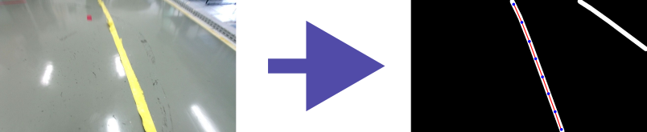

<h1 align="center">
<br/><br/>
Transfer Learning-based Lane Line Detection System for Visual Path Following Control
</h1>

<h4 align="center">
    <a href="#introduction">Introduction</a> |
    <a href="#dependencies">Dependencies</a> |
    <a href="#installation">Installation</a> |
    <a href="#nodes">Nodes</a> |
    <a href="#launch-files">Launch Files</a> |
    <a href="#gpu-support">GPU Support</a>
</h4>

## Introduction

This repository contains the code for the ROS package `prediction` which is used to detect a path from a camera image.

Clone the repository into your catkin workspace:
    
```bash
cd ~/catkin_ws/src
git clone git@github.com:allan-almeida1/prediction.git
```

## Dependencies

[](http://wiki.ros.org/noetic/Installation)
[](https://www.tensorflow.org/)
[](https://opencv.org/)
[](https://numpy.org/)
[](https://www.mlpack.org/)
[](http://eigen.tuxfamily.org/index.php?title=Main_Page)

The package depends on the following libraries:

- [ROS](http://wiki.ros.org/ROS/Installation)
- [TensorFlow](https://www.tensorflow.org/install)
- [OpenCV](https://opencv.org/)
- [NumPy](https://numpy.org/)
- [MLPack](https://www.mlpack.org/)
- [Eigen](http://eigen.tuxfamily.org/index.php?title=Main_Page)

TensorFlow, OpenCV (python) and NumPy will be installed automatically when you run the script to create the conda environment. The other dependencies need to be installed manually, using rosdep.

To install all the dependencies, run the following commands:
    
```bash
cd ~/catkin_ws
rosdep update
rosdep install --from-paths src --ignore-src -r -y
```

## Compilation

To compile the package, run catkin_make in the catkin workspace:

```bash
cd ~/catkin_ws
catkin_make # or catkin build
```

## Nodes

The package contains the following nodes:

- **prediction.py**: This node is used to detect a path from a camera image. It subscribes to the topic defined by param `/prediction_node/topic_name` and runs semantic segmentation on the image using an adapted version of the ERFNet model. The node then publishes the binary image to the topic `/image_raw_bin`.

- **processing**: This node is used to process the binary image published by the `prediction` node. It subscribes to the topic `/image_raw_bin` and runs processing steps like normalization and polynomial fitting on the image using RANSAC algorithm. The node then publishes the polynomial coefficients, image resolution and y limits to the topic `/prediction/path`.

## Launch Files

To run the package on a video file, use the following command:

```bash
roslaunch prediction video.launch
```

To run the package on a ROS topic in the simulation environment, use the following command:

```bash
roslaunch prediction unity.launch
```

## Unit Tests

To run the unit tests, use the following command:

```bash
rostest prediction unit_tests.test
```

or
    
```bash
rosrun prediction unit_tests
```

## Parameters

To adjust the parameters related to the processing node, edit the file `config/processing_params.yml`. Parameters are explained in the following table:

| Parameter | Description | Default Value |
| --- | --- | --- |
| `processing/window_size` | Number of frames window to calculate moving average for RANSAC | 6 |
| `processing/order` | Order of the polynomial to fit | 3 |
| `processing/min_samples` | Minimum number of samples required to fit a polynomial (must be at least polynomial order + 1) | 4 |
| `processing/threshold` | Maximum distance from the fitted polynomial for a sample to be considered as an inlier | 10 |
| `processing/max_iterations` | Maximum number of iterations for RANSAC | 200 |
| `processing/n_points` | Number of points used to draw the curve for the lane | 8 |


## Running the Prediction Node and GPU Support

To enable GPU support, you need to install the CUDA Toolkit and cuDNN. Then, you need to install the GPU version of TensorFlow. A script was created to automate this process and setup a virtual conda environment.

First, make sure you have conda installed. If not, you can install it using the following commands:

```bash
cd /tmp
curl -O https://repo.anaconda.com/archive/Anaconda3-2020.11-Linux-x86_64.sh
bash Anaconda3-2020.11-Linux-x86_64.sh
source ~/.bashrc
```

Then, run the following command to create the conda environment:

```bash
conda create --name <env_name> python=3.8 # or any other version
```

To install the required packages, go back to the root of the repository and run the following script:

```bash
./scripts/create_env.sh <env_name>
```

where `<env_name>` is the name of the environment you want to create, e.g. `tf_env`. The script will create a new conda environment with the name `<env_name>` and install all the required packages. To activate the environment, run the following command:

To run with GPU support, you need to activate the conda environment first:

```bash
conda activate <env_name>
```

Then, you can run the node as usual.

```bash
roslaunch prediction video.launch
```

**Note:** The script is set up to install CUDA Toolkit 11.8, cuDNN 8.6.0.163 and Tensorflow 2.13. If you want to use different versions, you need to edit the script accordingly.
